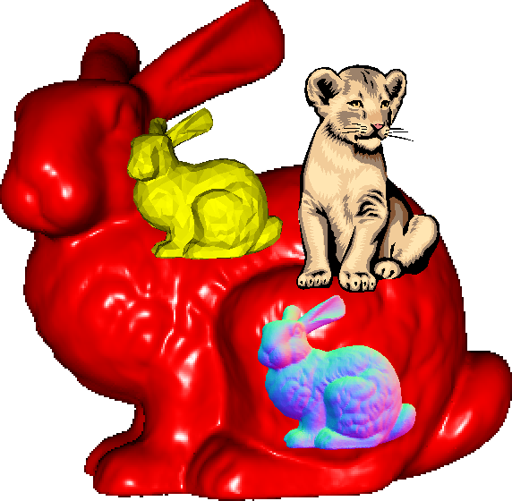

| **Credit Points**     | 5 ECTS                   |
| **Lectures**          | 90 minutes weekly        |
| **Labs**              | 90 minutes weekly        |
| **Duration**          | 15 weeks                 |
| **Grading**           | 90 minutes written exam  |
| **Bonus Grades**      | Voluntary presentations of a lab or theory assignment gives 10% extra credit on final exam  |

# Contents

- Frame Buffer and Color Representation
- Recap. of Linear Algebra and Analytic Geometry
- Line Rasterization
- Triangle Rasterization
- Barycentric Interpolation
- Transformations (Rotation, Translation, Linear, Affine)
- Viewing (Projective Transformations)
- Visible Surface Determination
- Lighting
- Shading

# Teaching Goals

- Learn the fundamentals of rasterization and computer graphics
- Understand, handle, solve, and explain  typical computer graphics theory problems
- Write a basic software triangle rasterization 

# Slides

<a href="https://zenodo.org/records/20843656" target="_blank" rel="noopener noreferrer">
  Power-Point Slides
</a>

# Lab Assignments

We create a simple 3D software rasterizer in C.
Students learn
- C Programming
- Project management with CMake
- Unit Tests (with Unity)
- Use an IDE, such as Visual Studio, for programming, debugging, and testing.

Every week, there is a new lab assignment.

| **Week i**             | Start assignment i in class, ask questions  |
| **Week i + 1**         | Present solution of i+1 in class            |

## A00Vec3Maths
Implement basic vector and matrix mathematics in C. 

## A01BasicRaster
Play a bit with a simple image and draw a circle and a box.

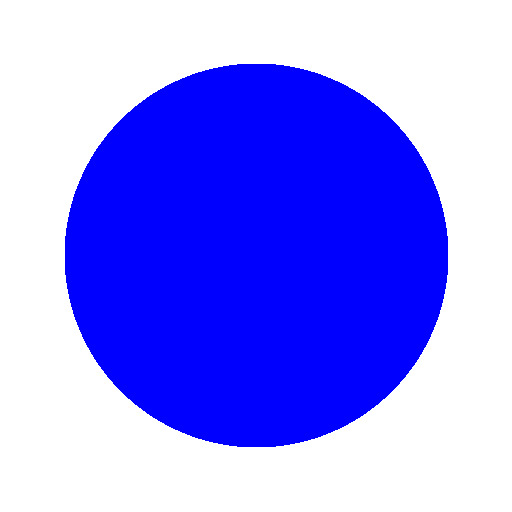

## A02Triangle
Draw a triangle.

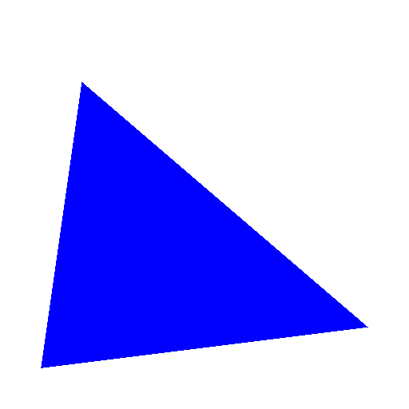

## A03Mesh2D

Draw 2D mesh with rigid transformations.
Here is an example output from the test-cases:

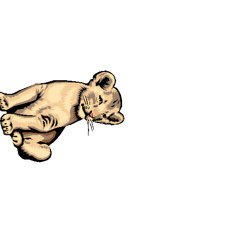

## A04Mesh3DNoZBuffer

Draw a 3D mesh with perspective transformation but no z buffer.
You should expect to see some rendering artifacts.

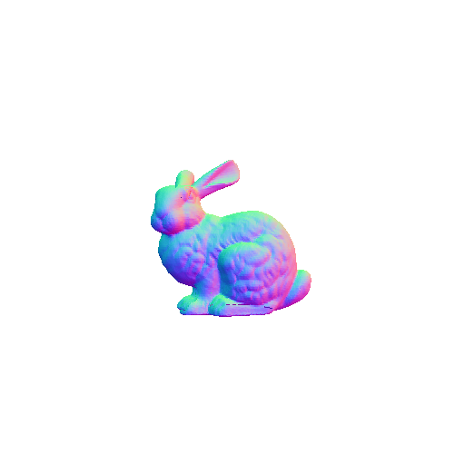

## A05TriangleGouraud

Draw a triangle with barycentric interpolation.

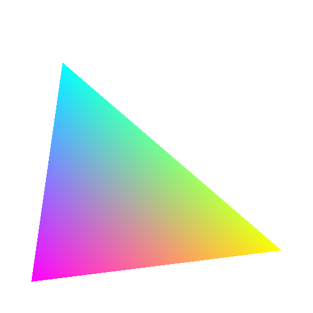

## A06Mesh3DZBuffer

Add a Z Buffer for correct depth.

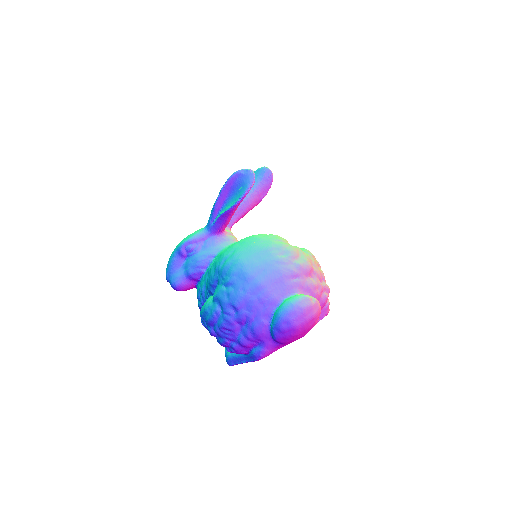

## A07FlatShading

We shade the faces with flat shading.

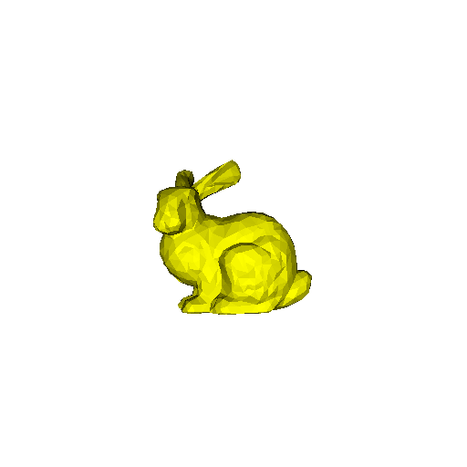

## A08GouraudShading

Next, we compute the lighting at the vertices and interpolate the result across the triangle.

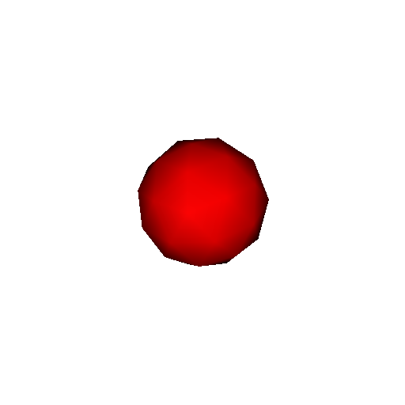

## A09PhoneShading

For better lighting, we compute the lighting at each pixel.

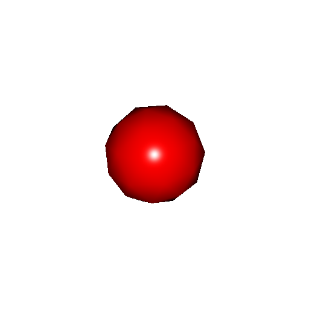

## A10Optimize
Optimize the speed with OpenMP, SIMD, replace small triangles with points, cull, etc.
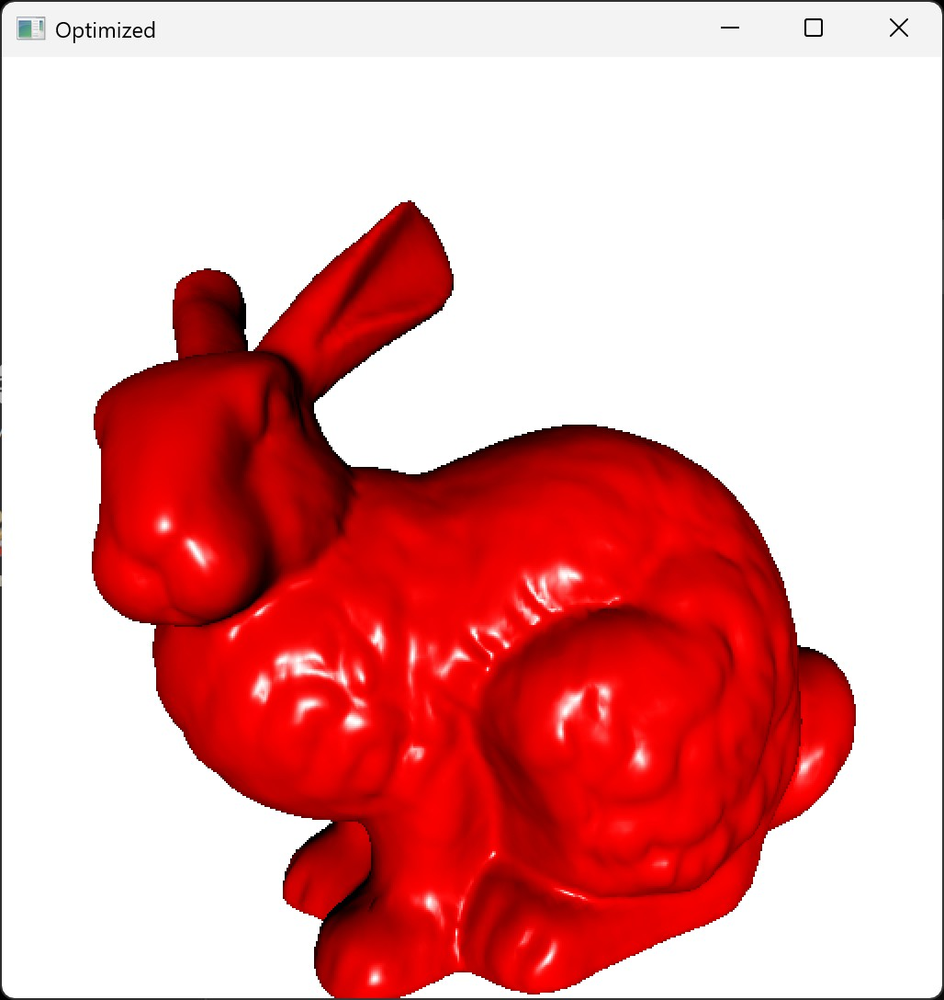

# AI Usage

While most AIs can solve the lab and theory assignments, I recommend not using them.
You will lose a great teaching experience, plus
- I will ask multiple lab assignment questions in the final exam and there your only AI is a calculator.
- It is fun to do the labs on your own or even better with a friend.
- The best fun is to ask me in class :-)
- You get extra credit if you present an assignment.
